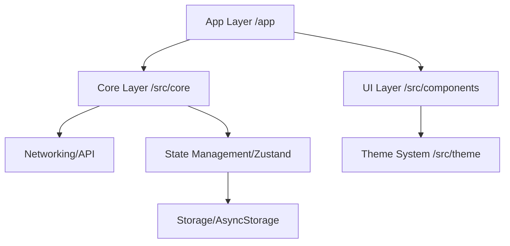

# Kien Truc Du An UniShare Mobile

Tai lieu nay quy dinh cac tieu chuan kien truc, cau truc thu muc va quy tac phat trien cho du an `sociedu-mobile`.

---

## 1. Cong Nghe Loi

| Thanh phan | Cong nghe |
| :--- | :--- |
| Framework | React Native + Expo |
| Routing | Expo Router |
| State Management | Zustand |
| Storage | AsyncStorage |
| Networking | Axios + Interceptors |
| UI/Styling | React Native StyleSheet + custom design system |
| Icons | Expo vector icons |

---

## 2. Quy Tac Dat Ten

- Thu muc: `kebab-case`
- Route file: `kebab-case`, `index.tsx`, `[id].tsx` theo chuan Expo Router
- Component: `PascalCase`
- Hook, service, util: `camelCase`
- Hang so bat bien: `UPPER_SNAKE_CASE`

---

## 3. Cau Truc Thu Muc

Du an ap dung huong feature-based tren nen Expo Router, trong do:

- `app/`: route entry, layout, route wiring
- `src/features/`: source of truth theo domain, chua `screens`, `services`, `adapters`, `store`, `components` theo nhu cau
- `src/components/`: UI component dung lai
- `src/core/`: service, store, adapter, API, type, mock
- `src/theme/`: theme token, breakpoint, responsive utilities
- `docs/`: tai lieu kien truc va quy uoc bo sung

Nhung feature da duoc tach theo huong nay hien gom `auth`, `booking`, `home`, `marketplace`, `mentor`, `message`, `profile`, `admin`.

Quy tac vang:

- Khong tao them lop logic moi o root neu no thuoc `src/` hoac `app/`.
- Khong dat business logic nang trong `app/` neu co the dua vao `src/features/`.
- Khong xem thu muc `components/` o root la noi mo rong component chinh cua du an.

---

## 4. Architecture Layers

---

## 5. Luong Du Lieu Va State

### 5.1 Authentication

- Root guard nam o `app/_layout.tsx`
- `authStore` quan ly user, role, trang thai xac thuc va hydrate
- Khi khoi dong app, session duoc phuc hoi tu AsyncStorage
- Neu chua xac thuc, nguoi dung bi dieu huong ve `/(auth)/login`

### 5.2 Networking

- Request interceptor tu dong gan bearer token
- Response interceptor xu ly `401`, refresh token va clear session khi can
- Data backend duoc map qua adapter neu shape chua phu hop voi app model
- Mock data duoc ho tro qua `src/core/config.ts` va `src/core/mocks/`

---

## 6. UI Va Design System

- Khong hard-code mau sac tuy tien trong screen neu da co token trong `src/theme/theme.ts`
- Spacing va typography phai bam design token
- Uu tien dung component noi bo nhu `Typography`, `CustomButton` va cac component tai `src/components/`

### 6.1 Responsive Design

Responsive la quy chuan bat buoc.

- Nguon su that cho responsive nam o `src/theme/responsiveUtils.ts`, `src/theme/theme.ts` va cac responsive helper theo component.
- Typography, spacing, avatar, card, button height va cac kich thuoc UI quan trong phai scale theo utility hien co.
- Khong hard-code kich thuoc co dinh trong screen neu da co scale function hoac token phu hop.
- Khi tao component moi, uu tien dung token va utility responsive thay vi so raw.

### 6.2 Responsive Sources Of Truth

- `src/theme/responsiveUtils.ts`
- `src/theme/theme.ts`
- `src/theme/breakpoints.ts`
- `src/components/button/buttonResponsive.ts`
- `src/components/form/textInputResponsive.ts`
- `src/components/ui/cardResponsive.ts`
- `src/components/ui/sectionResponsive.ts`
- `src/components/typography/typographyResponsive.ts`

### 6.3 Quy Tac Khi Sua UI

- Doc file component va responsive helper lien quan truoc khi sua.
- Kiem tra spacing, font size, avatar size, hero size da bam theme hoac scale utility chua.
- Khong copy raw number tu man nay sang man khac neu chua xac minh voi responsive system.
- Neu can pha quy chuan scale, phai co ly do ro rang.

### 6.4 Checklist Kiem Tra Responsive

- Kiem tra it nhat mot man hinh hep va mot man hinh rong.
- Xac minh typography khong qua to o thiet bi nho va khong qua nho o thiet bi lon.
- Xac minh spacing, card, avatar, button khong bi phong, chat hoac mat can doi.
- Khi sua home, mentor, profile hoac component dung lai, coi responsive impact la bat buoc phai check.

---

## 7. Quy Tac Import

- Uu tien alias `@/` neu file dang sua da theo huong nay
- Tranh duong dan tuong doi dai kho doc nhu `../../../`
- Giu nhat quan trong tung file va tung module

---

## 8. Hieu Nang Va Bao Mat

### Performance

- Uu tien component gon, ro trach nhiem
- Can nhac toi list performance khi du lieu lon
- Khong them abstraction nang neu chua co nhu cau that

### Security

- Khong luu thong tin nhay cam dang plain text neu co lua chon an toan hon
- Validate du lieu dau vao o tang service khi can
- Khong de auth logic rai rac o nhieu screen

---

## 9. Nguyen Tac Mo Rong

- Feature moi phai di dung lop: route, service, adapter, store, UI
- Khong de screen tro thanh noi chua business logic chinh
- Store chi danh cho shared state, khong danh cho local UI state thuan man hinh
- Adapter la noi map DTO backend sang model app khi can

---

## 10. File Can Doc Khi Canh Chinh Kien Truc

- `app/_layout.tsx`
- `app/(auth)/_layout.tsx`
- `app/(tabs)/_layout.tsx`
- `src/core/api.ts`
- `src/core/config.ts`
- `src/core/store/authStore.ts`
- `src/theme/theme.ts`
- `src/theme/responsiveUtils.ts`
- `.agent/instruction.md`
- `.agent/mandatory-reading.md`
- `.agent/skill.md`
