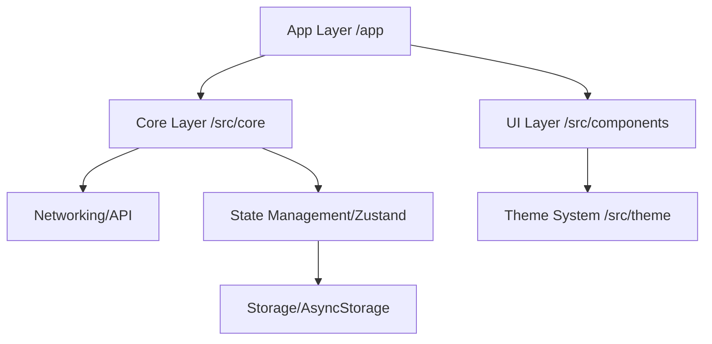

# Kiến trúc Dự án UniShare Mobile (Senior Standard)

Tài liệu này quy định các tiêu chuẩn kiến trúc, cấu trúc thư mục và quy tắc phát triển dành cho dự án UniShare Mobile. Toàn bộ thành viên cần tuân thủ nghiêm ngặt để đảm bảo tính nhất quán và khả năng mở rộng.

---

## 1. Công nghệ lõi (Tech Stack)

| Thành phần | Công nghệ |
| :--- | :--- |
| **Framework** | React Native + Expo (SDK 50+) |
| **Routing** | Expo Router (File-based routing) |
| **State Management** | Zustand |
| **Storage** | AsyncStorage (Persist via Zustand) |
| **Networking** | Axios + Interceptors |
| **UI/Styling** | React Native StyleSheet + Custom Design System |
| **Icons** | Lucide React Native / Expo Icons |

---

## 2. Quy tắc Đặt tên (Naming Conventions)

- **Thư mục:** `kebab-case` (ví dụ: `auth-services`, `mentor-profile`).
- **Màn hình (Routes):** `kebab-case` hoặc `[id].tsx` (theo chuẩn Expo Router).
- **Components:** `PascalCase` (ví dụ: `CustomButton.tsx`, `MentorCard.tsx`).
- **Hooks/Services/Utils:** `camelCase` (ví dụ: `useAuth.ts`, `authService.ts`).
- **Constants/Types:** `camelCase` hoặc `UpperSnakeCase` cho hằng số (ví dụ: `COLORS`, `UserType`).

---

## 3. Cấu trúc thư mục (Folder Structure)

Dự án tuân thủ cấu trúc **Modular Layered Architecture**, tập trung toàn bộ logic vào thư mục `src/`.

```text
📦 unishare_mobile
 ┣ 📂 app                   # [Routing Layer] Chỉ chứa các định nghĩa Route
 ┃ ┣ 📂 (auth)              # Luồng đăng nhập, đăng ký
 ┃ ┣ 📂 (tabs)              # Luồng chính (Home, Mentor, Profile)
 ┃ ┣ 📂 [module]            # Các màn hình chi tiết (profile, booking, ...)
 ┃ ┗ 📜 _layout.tsx         # Root Layout & Auth Guarding logic
 ┣ 📂 src                   # [Core Layer] Trái tim của ứng dụng
 ┃ ┣ 📂 assets              # Icons, Images, Fonts (Static files)
 ┃ ┣ 📂 components          # UI Components phân loại theo chức năng
 ┃ ┃ ┣ 📂 ui                # Atomic components (Button, Input, Badge)
 ┃ ┃ ┣ 📂 form              # Form logic & Input groups
 ┃ ┃ ┣ 📂 display           # Card, List, Complex UI elements
 ┃ ┃ ┗ 📂 states            # Loading, Empty, Error states
 ┃ ┣ 📂 core                # Quản trị logic nghiệp vụ
 ┃ ┃ ┣ 📂 services          # API calls (authService, userService, ...)
 ┃ ┃ ┣ 📂 store             # State management (Zustand stores)
 ┃ ┃ ┣ 📂 hooks             # Custom hooks dùng chung (useAuth, useDebounce)
 ┃ ┃ ┣ 📂 utils             # Helper functions (formatDate, validators)
 ┃ ┃ ┣ 📜 api.ts            # Axios configuration & Interceptor
 ┃ ┃ ┗ 📜 types.ts          # Global TypeScript interfaces
 ┃ ┗ 📂 theme               # Design System (colors, spacing, typography)
 ┗ 📜 ... config files
```

> [!IMPORTANT]
> **Quy tắc vàng:** Không tạo thêm thư mục logic ở gốc dự án. Mọi thứ phải nằm trong `src/` hoặc `app/`.

---

## 4. Sơ đồ Kiến trúc (Architecture Layers)



---

## 5. Luồng Dữ liệu & Quản lý State

### 5.1 Xử lý Xác thực (Authentication)
Dự án sử dụng cơ chế **Global Guard** tại `app/_layout.tsx`.
- `authStore` quản lý trạng thái `token` và `user`.
- Khi khởi động, app thực hiện `hydrate()` để phục hồi session từ `AsyncStorage`.
- Nếu `isAuthenticated` là `false`, người dùng tự động bị điều hướng về `/(auth)/login`.

### 5.2 Networking (Axios Interceptors)
- **Request Interceptor:** Tự động đính kèm `Authorization: Bearer <token>` vào mọi yêu cầu.
- **Response Interceptor:** 
    - Xử lý lỗi 401 tự động (Logout người dùng nếu token hết hạn).
    - Map dữ liệu từ API về chuẩn của App.
- **Mocking:** Hỗ trợ dữ liệu giả (Mock Data) khi Backend chưa sẵn sàng.

---

## 6. Tiêu chuẩn UI/UX (Design System)

Tất cả màn hình **KHÔNG** được sử dụng mã màu inline. Phải tham chiếu từ `theme.ts`:

- **Spacing:** Sử dụng hệ số 4 (4, 8, 12, 16, 24, 32).
- **Typography:** Chỉ sử dụng các variant `h1`, `h2`, `body`, `caption` định nghĩa sẵn.
- **Components:** Ưu tiên sử dụng `CustomButton`, `Typography` thay cho các thẻ mặc định của React Native.

---

## 7. Quy tắc Import (Path Aliases)

Khuyến khích sử dụng Absolute Path để tránh các đường dẫn `../../../`:
- `@/app/*`
- `@/components/*`
- `@/core/*`
- `@/theme/*`

---

## 8. Hiệu năng & Bảo mật

1. **Performance:** 
    - Sử dụng `FlashList` thay cho `FlatList` cho các danh sách dài.
    - Memoize các component nặng bằng `React.memo`.
2. **Security:**
    - Không lưu thông tin nhạy cảm vào `AsyncStorage` dưới dạng plain text (nếu có thể hãy dùng SecureStore).
    - Validate dữ liệu đầu vào tại tầng Service.

---

## 9. Danh sách Màn hình (Roadmap)

| Route | Chức năng | Trạng thái |
| :--- | :--- | :--- |
| `/(auth)/login` | Đăng nhập |  Done |
| `/(tabs)/index` | Trang chủ |  Done |
| `/profile/[id]` | Chi tiết Mentor |  In progress |
| `/mentor/dashboard` | Quản trị Mentor |  Planned |
