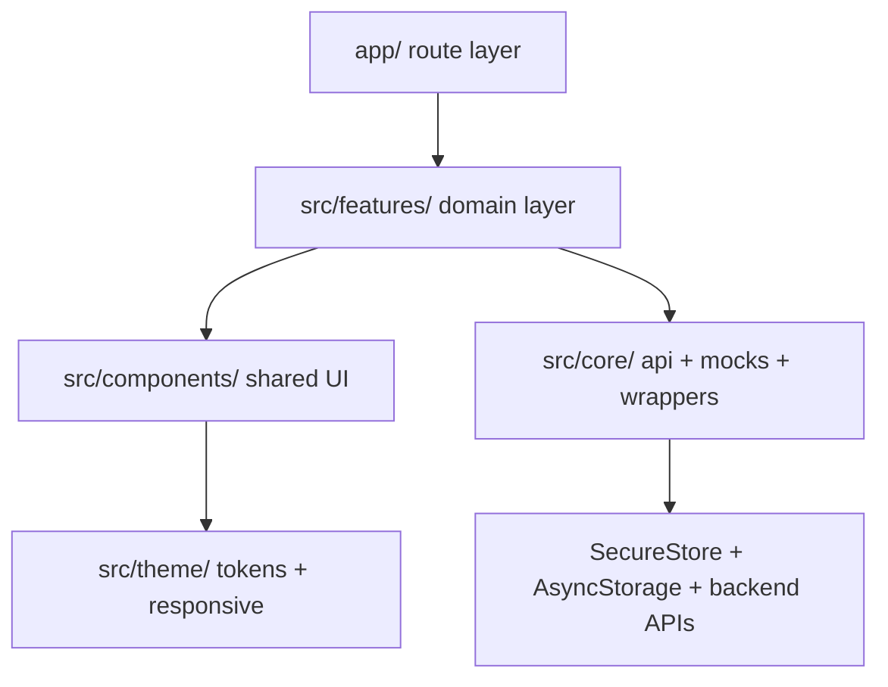

# Kien Truc Du An UniShare Mobile

Tai lieu nay mo ta kien truc hien tai cua `sociedu-mobile` theo feature-based structure.

## 1. Cong nghe loi

| Thanh phan | Cong nghe |
| --- | --- |
| Framework | React Native + Expo |
| Routing | Expo Router |
| State Management | Zustand |
| Token storage | Expo SecureStore |
| User cache | AsyncStorage cho du lieu non-sensitive |
| Networking | Axios + interceptors |
| UI | Shared components + theme tokens |
| Language | TypeScript `strict` |

## 2. Cau truc thu muc

- `app/`: route entry, layout, route wiring.
- `src/features/`: source of truth theo domain.
- `src/components/`: shared UI components.
- `src/core/`: API layer, mocks, wrappers, config, shared types.
- `src/theme/`: theme tokens, breakpoints, responsive utilities.
- `.agent/`: operating docs cho coding agents.
- `docs/`: tai lieu bo sung cho kien truc.

## 3. Feature map hien tai

| Feature | Thanh phan hien co |
| --- | --- |
| `auth` | screens, services, adapters, store |
| `booking` | screens, services, adapters, store, components, payment result flow |
| `home` | screens |
| `mentor` | screens, services, adapters, components, paginated listing contract |
| `message` | screens, backend/mock-aware chat service |
| `profile` | screens, services, adapters |
| `admin` | protected moderation dashboard, admin service |

## 4. Route map hien tai

### Auth group

- `/(auth)/welcome`
- `/(auth)/login`
- `/(auth)/register`
- `/(auth)/forgot-password`
- `/(auth)/otp`
- `/(auth)/reset-password`

### Tabs group

- `/(tabs)`
- `/(tabs)/mentor`
- `/(tabs)/messages`
- `/(tabs)/bookings`
- `/(tabs)/profile`

### Ngoai tab group

- `/admin/index`
- `/booking/[id]`
- `/booking/payment-result`
- `/mentor/[id]`
- `/mentor/dashboard`
- `/mentor/services`
- `/mentor/services/form`
- `/messages/[id]`
- `/package/[id]`
- `/profile/[id]`
- `/profile/edit`

## 5. Auth, Config Va Protected Routing

- `app/_layout.tsx` hydrate auth store, redirect guest ve auth flow va redirect logged-in user khoi auth flow.
- Token access/refresh luu bang `expo-secure-store` qua `tokenStorage` trong `src/core/api.ts`.
- Cached user luu AsyncStorage va chi nen chua du lieu non-sensitive can hydrate UI.
- Khi refresh token fail, API layer clear storage va goi `expireSession()` gian tiep qua session-expired handler.
- `ProtectedRoute` chi la client UX guard cho navigation. Backend endpoint bat buoc enforce role va ownership.

## 6. API Va Mock Strategy

- `src/core/config.ts` doc `EXPO_PUBLIC_API_BASE_URL` va `EXPO_PUBLIC_USE_MOCK`.
- Production runtime fail-fast neu thieu API URL, API URL khong dung HTTPS, hoac mock dang bat.
- `API_BASE_URL` va `USE_MOCK` van duoc export de giu compatibility.
- Service layer chon mock/backend theo `USE_MOCK`; screen khong goi Axios truc tiep.
- API error duoc sanitize trong `src/core/api.ts`; UI khong nen hien raw backend payload.

## 7. Data Flow Chuan

Quy tac:

- Route files trong `app/` uu tien `export { default }`.
- Feature screens goi feature service, khong goi `api` truc tiep.
- Adapter map DTO sang mobile model truoc khi UI render.
- Compatibility wrappers trong `src/core/services`, `src/core/store`, `src/core/adapters` chi re-export.

## 8. Flow Dang Luu Y

- Payment: package detail bat buoc chon slot truoc checkout; checkout gui `{ packageVersionId, slotId }`; `/booking/payment-result` verify order status tu backend va chi polling fallback co gioi han.
- Mentor listing: `mentorService.getAll(query)` tra paginated result, backend nen tra mentor card DTO da gom profile fields de tranh N+1.
- Admin: admin dashboard co moderation queue approve/reject mentor va audit-log fallback.
- Message: chat service ho tro mock/backend, pagination, mark-read, report conversation; backend phai enforce ownership.

## 9. Kiem Tra

- `npm run typecheck`
- `npm run lint`
- Manual smoke voi login/logout, mentor list/detail, package checkout, bookings, admin, messages.
