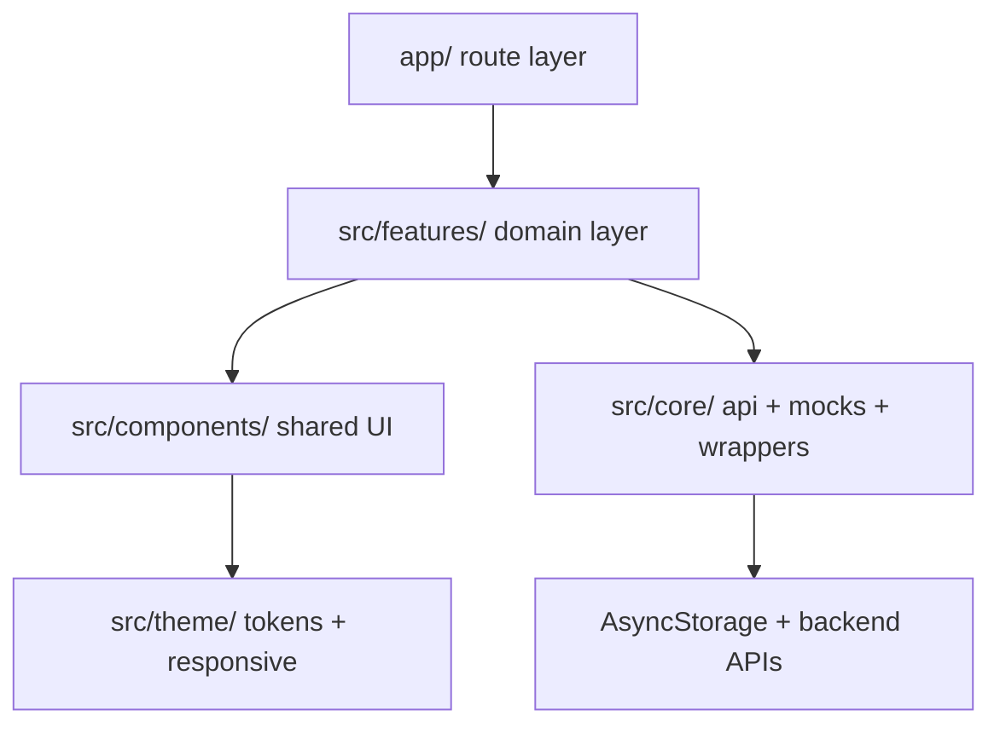

# Kien Truc Du An UniShare Mobile

Tai lieu nay mo ta kien truc hien tai cua `sociedu-mobile` theo trang thai codebase sau refactor feature-based.

## 1. Cong nghe loi

| Thanh phan | Cong nghe |
| --- | --- |
| Framework | React Native + Expo |
| Routing | Expo Router |
| State Management | Zustand |
| Storage | AsyncStorage |
| Networking | Axios + interceptors |
| UI | Shared components + theme tokens |
| Language | TypeScript `strict` |

## 2. Cau truc thu muc

- `app/`: route entry, layout, route wiring
- `src/features/`: source of truth theo domain
- `src/components/`: shared UI components
- `src/core/`: API layer, mocks, wrappers, types
- `src/theme/`: theme tokens, breakpoints, responsive utilities
- `.agent/`: operating docs cho coding agents
- `docs/`: tai lieu bo sung cho kien truc

## 3. Feature map hien tai

| Feature | Thanh phan hien co |
| --- | --- |
| `auth` | screens, services, adapters, store |
| `booking` | screens, services, adapters, store, components |
| `home` | screens |
| `marketplace` | screens placeholder |
| `mentor` | screens, services, adapters, components |
| `message` | screens, services |
| `profile` | screens, services, adapters |
| `admin` | protected screen skeleton |

## 4. Route map hien tai

### Auth group

- `/(auth)/welcome`
- `/(auth)/login`
- `/(auth)/register`

### Tabs group

- `/(tabs)`
- `/(tabs)/mentor`
- `/(tabs)/messages`
- `/(tabs)/bookings`
- `/(tabs)/profile`
- `/(tabs)/marketplace`
- `/(tabs)/marketplace/[id]`

`marketplace` dang bi an khoi tab bar bang `href: null`.

### Ngoai tab group

- `/admin/index`
- `/booking/[id]`
- `/mentor/[id]`
- `/mentor/dashboard`
- `/messages/[id]`
- `/profile/[id]`
- `/profile/edit`

## 5. Luong auth va protected routing

### Root layout

`app/_layout.tsx` la cong kiem soat session cua toan app:

- hydrate auth state tu AsyncStorage
- redirect user chua login ve `/(auth)/login`
- redirect user da login khoi auth group sang `/(tabs)`
- khai bao stack cho detail/protected screens

### Auth layout

`app/(auth)/_layout.tsx` chan user da login o lai auth screens.

### ProtectedRoute

`src/components/ProtectedRoute.tsx` xu ly:

- loading spinner khi auth store dang hydrate
- redirect guest ve `/(auth)/login`
- redirect sai role ve `/(tabs)`

## 6. Architecture layers

## 7. Quy tac layer

### Route layer

- `app/` chi nen chua route files, layout va route wiring
- route entry nen uu tien `export { default }` sang feature screen
- khong dua business logic nang vao route file

### Feature layer

- `src/features/<feature>/` la source of truth theo domain
- screens goi service va dung adapter/store cua feature
- component chi dung trong 1 feature nen dat trong feature do

### Core layer

- `src/core/api.ts` la noi cau hinh Axios instance, token helpers va refresh flow
- `src/core/config.ts` dieu khien cac config chung nhu `USE_MOCK`
- `src/core/types.ts` la noi dat DTO va app model chung
- `src/core/services/*`, `src/core/store/*`, `src/core/adapters/*` hien chu yeu la compatibility wrappers

### UI layer

- `src/components/` la shared UI layer cua ca app
- uu tien dung lai `Typography`, `CustomButton`, `Card`, `Section`, `Avatar`, `ListItem`, state components

### Theme layer

- `src/theme/theme.ts` chua token ve colors, spacing, radius, typography
- `src/theme/responsiveUtils.ts` chua cac utility scale va detection theo man hinh
- component moi nen bam vao token va utility thay vi so raw

## 8. Networking va mock strategy

- Service layer goi API qua `api` trong `src/core/api.ts`
- `unwrap()` duoc dung de lay `response.data.data`
- `USE_MOCK` trong `src/core/config.ts` quyet dinh service di qua mock hay backend that
- Chat hien tai van mock-first qua `src/core/mocks/chatMocks.ts`

## 9. Responsive system

Nguon su that cho responsive:

- `src/theme/theme.ts`
- `src/theme/responsiveUtils.ts`
- `src/theme/breakpoints.ts`
- responsive helper di kem component trong `src/components`

Quy tac:

- khong hard-code kich thuoc lon neu utility da co
- typography, spacing, avatar, card, button phai kiem tra tren man hep va man rong

## 10. Kien truc data va type

- DTO backend nam trong `src/core/types.ts`
- app models cung nam trong `src/core/types.ts`
- feature adapters map DTO sang shape UI can dung
- screen khong tu map raw backend response neu adapter da la noi chuan hoa

## 11. Diem can chu y hien tai

- `API_BASE_URL` dang hard-code theo IP LAN trong `src/core/api.ts`
- `marketplace` va `admin` da o dung structure nhung logic con toi gian
- co wrappers trong `src/core` can tiep tuc duoc giu de tranh gay import cu
- lint command hien tai la `eslint .`

## 12. Nguyen tac mo rong

- Them feature moi: tao trong `src/features/<feature>/` truoc
- Chi tao wrapper trong `src/core` neu can compatibility
- Neu doi route map, auth flow, source of truth hoac shared UI rules, cap nhat `.agent/`, `SYSTEM.md` va file nay
