# SYSTEM.md - Mentor Marketplace cho sinh viên

## 1. Mục đích tài liệu

Tài liệu này mô tả đầy đủ bài toán, phạm vi hệ thống, actor, domain model, các luồng nghiệp vụ chính và các ràng buộc triển khai cho nền tảng **Mentor Marketplace cho sinh viên**.

Tài liệu này được dùng như một bản mô tả hệ thống cấp cao cho Product, Design, Engineering, QA và Operations khi thiết kế, xây dựng, kiểm thử và vận hành MVP.

Nguồn nghiệp vụ chính:

- PRD v2.1: mô tả vision sản phẩm đầy đủ cho Mentor Marketplace.
- PRD v2.2 Data-aligned: điều chỉnh phạm vi MVP để khớp với schema/data model hiện tại.

---

## 2. Tổng quan bài toán

Sinh viên hiện thường tìm mentor qua các kênh rời rạc như Facebook, Discord, Telegram, cộng đồng trường lớp hoặc giới thiệu cá nhân. Các kênh này không chuẩn hóa hồ sơ mentor, thiếu minh bạch về giá, lịch rảnh, deliverables, chính sách hủy và không có cơ chế giao dịch an toàn.

Nền tảng cần giải quyết bài toán kết nối giữa:

- **Buyer / Student / Mentee**: người cần tìm mentor, đặt lịch, thanh toán, trao đổi và theo dõi tiến độ.
- **Mentor**: người cung cấp dịch vụ tư vấn theo buổi hoặc theo gói có cấu trúc.
- **Admin / Moderator / Operations**: đội ngũ kiểm duyệt, xử lý báo cáo, tranh chấp, trạng thái người dùng, booking và payment.

Sản phẩm không phải là chợ tài liệu học tập và cũng không phải LMS đầy đủ. Trọng tâm là marketplace giao dịch dịch vụ tri thức giữa mentor và sinh viên.

---

## 3. Mục tiêu sản phẩm

### 3.1 Mục tiêu người dùng

Buyer cần:

- Tìm được mentor phù hợp theo chuyên môn, kinh nghiệm, giá, ngôn ngữ, rating và mức độ tin cậy.
- Hiểu rõ gói dịch vụ, thời lượng, deliverables và điều kiện trước khi thanh toán.
- Có kênh trao đổi chính thức với mentor.
- Có cơ chế report/dispute khi dịch vụ không đúng kỳ vọng.

Mentor cần:

- Tạo hồ sơ chuyên nghiệp.
- Tạo service package và curriculum rõ ràng.
- Nhận booking, trao đổi với buyer và theo dõi session.
- Có cơ chế nhận tiền minh bạch trong các phase sau.

Admin cần:

- Quản lý user, mentor, booking, order, payment, report và dispute.
- Có đủ bằng chứng, trạng thái và note để xử lý vận hành.
- Giảm rủi ro gian lận, spam, no-show và tranh chấp.

### 3.2 Mục tiêu kinh doanh

- Tạo GMV từ dịch vụ mentor.
- Xây dựng marketplace mentor có thể mở rộng theo trường, ngành, chủ đề và kỹ năng.
- Tăng conversion từ profile view sang booking.
- Tăng repeat booking và retention.
- Tạo nền tảng mở rộng sang mentoring theo phiên, theo gói và theo hành trình.

### 3.3 Mục tiêu vận hành

- Chuẩn hóa quy trình onboarding mentor.
- Chuẩn hóa booking, payment, session, messaging, report và dispute.
- Lưu vết các entity quan trọng để hỗ trợ đối soát và xử lý tranh chấp.
- Tách rõ phần đã có data model, phần MVP xử lý manual/logical và phần future phase.

---

## 4. Nguyên tắc sản phẩm

1. **Trust-first**: buyer chỉ giao dịch khi hiểu mentor là ai, gói dịch vụ là gì và nếu có vấn đề thì được xử lý ra sao.
2. **Clarity-before-checkout**: trước checkout phải rõ giá, duration, deliverables, chính sách hủy, refund/dispute và hình thức thực hiện.
3. **In-platform communication first**: ưu tiên nhắn tin trong nền tảng để lưu vết, giảm no-show và hỗ trợ dispute.
4. **Operationally manageable**: MVP phải dễ vận hành, không tạo quá nhiều quy trình thủ công không kiểm soát.
5. **Data-aligned MVP**: chỉ cam kết đầy đủ những năng lực đã có data model hỗ trợ; những phần chưa có schema phải ghi rõ là manual/logical hoặc future phase.
6. **Auditability by design**: mọi thay đổi quan trọng nên có dấu vết, dù audit log đầy đủ có thể nằm ở phase sau.

---

## 5. Phạm vi hệ thống

## 5.1 Phạm vi MVP theo data model hiện tại

MVP hiện tại nên được định nghĩa là:

> Mentor Marketplace có package curriculum, order/payment, booking session, chat, report/dispute và progress report.

Các năng lực in-scope:

| Nhóm chức năng | Năng lực MVP |
|---|---|
| Identity & Access | Đăng ký, đăng nhập, refresh token, OTP token, user status, role, capability |
| User Profile | Hồ sơ cá nhân, ngôn ngữ, học vấn, kinh nghiệm, chứng chỉ |
| Mentor Profile | Headline, expertise dạng text, base price, rating average, sessions completed, verification status |
| Service Package | Package, package version, curriculum/module |
| Order & Payment | Order, payment transaction, provider response |
| Booking | Booking gắn buyer, mentor, package version và order |
| Booking Session | Nhiều session trong một booking, meeting URL, evidence |
| Messaging | Conversation, participant, message, attachment |
| Report | Report theo entity type, report evidence |
| Dispute | Dispute gắn report, booking hoặc session |
| File | Metadata file dùng chung cho avatar, certificate, evidence, attachment |
| Progress Report | Mentee progress report, mentor feedback |

### 5.2 Out-of-scope hoặc manual trong MVP hiện tại

Các năng lực sau **không nên cam kết là fully supported** nếu chưa bổ sung migration/schema:

| Năng lực | Trạng thái |
|---|---|
| Availability calendar chuẩn | Future phase hoặc cần migration |
| Slot locking / double-booking prevention | Chưa supported bằng DB hiện tại |
| Escrow ledger | Logical/manual MVP |
| Payout ledger | Future phase |
| Refund transaction riêng | Future phase |
| Review table và review moderation | Future phase |
| Notification center | Future phase |
| Message read receipt / unread count chính xác | Future phase |
| Admin audit log đầy đủ | Future phase |
| Analytics event tracking | Future phase |
| Fee/refund/verification rule config | Future phase |
| Expertise category normalized | Future phase |
| Realtime messaging bắt buộc | Không bắt buộc trong MVP |
| Reschedule flow riêng | Future phase |

---

## 6. Actor và quyền hạn

## 6.1 Buyer / Student / Mentee

Buyer có thể:

- Đăng ký, đăng nhập, xác thực email/OTP.
- Cập nhật profile cá nhân.
- Tìm kiếm và xem mentor.
- Xem package, package version và curriculum.
- Tạo order từ package version.
- Thanh toán.
- Có booking và booking sessions sau khi payment thành công.
- Nhắn tin với mentor qua conversation.
- Tạo report/dispute nếu có vấn đề.
- Xem hoặc tạo progress report nếu flow được bật.

Buyer không được:

- Truy cập booking/order/conversation của người khác.
- Tự sửa trạng thái payment, dispute hoặc booking trái quyền.
- Tạo dispute ngoài điều kiện chính sách nếu hệ thống đã giới hạn.

## 6.2 Mentor

Mentor có thể:

- Cập nhật hồ sơ mentor.
- Tạo service package.
- Tạo service package version.
- Tạo curriculum/module cho package version.
- Xem booking và booking sessions của mình.
- Trao đổi với buyer trong conversation.
- Cập nhật trạng thái session theo quyền được cấp.
- Upload hoặc xem evidence liên quan session nếu có quyền.
- Phản hồi progress report của mentee.

Mentor không được:

- Xem dữ liệu riêng của mentor khác.
- Tự duyệt verification status của mình.
- Tự can thiệp payment/refund/dispute nếu không có quyền admin.
- Nhận booking công khai nếu verification status chưa đạt điều kiện platform.

## 6.3 Admin / Moderator / Operations

Admin có thể:

- Quản lý user và user status.
- Quản lý role/capability nếu có UI tương ứng.
- Duyệt hoặc cập nhật verification status của mentor.
- Tra cứu order, payment transaction, booking và booking sessions.
- Xem evidence files theo quyền vận hành.
- Xử lý reports và disputes.
- Xem conversation/support thread khi có lý do hợp lệ.
- Cập nhật resolution note cho dispute/report.

Admin không nên:

- Chỉnh sửa dữ liệu giao dịch quan trọng mà không để lại log/note.
- Truy cập private conversation nếu không có căn cứ vận hành.
- Xử lý refund/payout ngoài policy đã được định nghĩa.

---

## 7. Module hệ thống

## 7.1 Identity & Access

### Mục tiêu

Cung cấp xác thực, session management và phân quyền theo role/capability.

### Entity chính

- `users`
- `roles`
- `capabilities`
- `user_roles`
- `role_capabilities`
- `user_credentials`
- `refresh_tokens`
- `otp_tokens`

### Business rules

- Email phải unique.
- Một user có thể có nhiều role.
- Một role có nhiều capability.
- Capability là đơn vị nhỏ nhất để kiểm tra quyền.
- User có trạng thái: `pending`, `active`, `suspended`.
- User chưa active có thể bị giới hạn booking, payment, messaging hoặc mentor onboarding.
- Refresh token có thể bị revoke.
- OTP token có type riêng cho verify email, reset password hoặc flow xác thực khác.

### API gợi ý

- `POST /auth/register`
- `POST /auth/login`
- `POST /auth/logout`
- `POST /auth/refresh`
- `GET /auth/me`
- `POST /auth/verify-email/request`
- `POST /auth/verify-email/confirm`
- `POST /auth/password/forgot`
- `POST /auth/password/reset`
- `GET /auth/sessions`
- `DELETE /auth/sessions/{sessionId}`

---

## 7.2 User Profile & Professional Information

### Mục tiêu

Chuẩn hóa thông tin người dùng, học vấn, kinh nghiệm, ngôn ngữ và chứng chỉ.

### Entity chính

- `user_profiles`
- `user_languages`
- `user_experiences`
- `user_educations`
- `user_certificates`
- `universities`
- `fields_of_study`
- `files`

### Business rules

- User có thể cập nhật họ tên, avatar, headline, bio, location.
- User có thể khai báo nhiều ngôn ngữ, học vấn, kinh nghiệm và chứng chỉ.
- Chứng chỉ có thể gắn với file minh chứng.
- File private không được public trực tiếp.
- API download file phải kiểm tra quyền theo entity liên quan.

### API gợi ý

- `GET /users/me/profile`
- `PATCH /users/me/profile`
- `GET /users/me/languages`
- `POST /users/me/languages`
- `PATCH /users/me/languages/{languageId}`
- `DELETE /users/me/languages/{languageId}`
- `GET /users/me/educations`
- `POST /users/me/educations`
- `PATCH /users/me/educations/{educationId}`
- `DELETE /users/me/educations/{educationId}`
- `GET /users/me/experiences`
- `POST /users/me/experiences`
- `PATCH /users/me/experiences/{experienceId}`
- `DELETE /users/me/experiences/{experienceId}`
- `GET /users/me/certificates`
- `POST /users/me/certificates`
- `PATCH /users/me/certificates/{certificateId}`
- `DELETE /users/me/certificates/{certificateId}`

---

## 7.3 Mentor Profile

### Mục tiêu

Cho phép user trở thành mentor, hiển thị năng lực chuyên môn và tạo trust signal ban đầu.

### Entity chính

- `mentor_profiles`
- `user_profiles`
- `user_experiences`
- `user_educations`
- `user_certificates`
- `files`

### Business rules

- `expertise` hiện là text mô tả tổng hợp, chưa normalize thành category/tag.
- `rating_avg` và `sessions_completed` là aggregate field.
- `verification_status` là trạng thái trực tiếp, chưa có workflow verification riêng.
- Chưa có `visibility_status`, `featured_flag`, `response_rate`, `response_time` nếu chưa bổ sung schema.
- Mentor profile chỉ public nếu `verification_status` đạt trạng thái được platform chấp nhận.
- Mentor bị suspended hoặc rejected không được nhận booking mới.

### API gợi ý

- `GET /mentors`
- `GET /mentors/{mentorId}`
- `GET /mentors/me/profile`
- `PUT /mentors/me/profile`
- `POST /mentors/me/profile/submit`

---

## 7.4 Mentor Marketplace, Package & Curriculum

### Mục tiêu

Cho phép mentor tạo dịch vụ tư vấn có cấu trúc để buyer có thể hiểu, so sánh và mua.

### Entity chính

- `service_packages`
- `service_package_versions`
- `package_curriculums`
- `mentor_profiles`

### Business rules

- `service_packages` là package cha.
- `service_package_versions` là phiên bản thương mại có giá, duration và delivery type.
- `package_curriculums` là danh sách nội dung/module/session plan trong package version.
- Buyer checkout trên `service_package_versions.id`, không checkout trực tiếp trên `service_packages.id`.
- Curriculum dùng để sinh booking sessions sau khi order/payment thành công.
- Package phải thuộc về một mentor cụ thể.
- Package của mentor chưa approved có thể không public.

### API gợi ý

- `GET /mentors/me/packages`
- `POST /mentors/me/packages`
- `PATCH /mentors/me/packages/{packageId}`
- `POST /mentors/me/packages/{packageId}/versions`
- `GET /packages/{packageId}`
- `GET /package-versions/{versionId}`
- `POST /package-versions/{versionId}/curriculums`
- `PATCH /package-curriculums/{curriculumId}`
- `DELETE /package-curriculums/{curriculumId}`

---

## 7.5 Order, Payment & Booking

### Mục tiêu

Chuẩn hóa flow giao dịch từ chọn package version, tạo order, ghi nhận payment, tạo booking và tạo sessions.

### Entity chính

- `orders`
- `payment_transactions`
- `bookings`
- `booking_sessions`
- `booking_session_evidences`

### Business rules

- Buyer chọn package version và tạo order.
- Payment success cập nhật order sang `paid`.
- Sau khi order `paid`, hệ thống tạo booking.
- Booking có một hoặc nhiều booking sessions.
- Lịch cụ thể lưu ở `booking_sessions.scheduled_at`.
- Nếu muốn chọn lịch trước checkout, MVP hiện tại cần lưu tạm ở application layer hoặc migration thêm `availability_slots`.
- Payment transaction lưu provider response trong `raw_response`.
- Payment webhook phải idempotent.
- User refresh nhiều lần ở payment success page không được tạo duplicate booking.
- Payment success nhưng booking create lỗi phải được retry hoặc đưa vào trạng thái cần support.

### Order statuses

- `pending_payment`
- `paid`
- `failed`
- `canceled`
- `refunded`

### Payment transaction statuses

- `pending`
- `success`
- `failed`

### Booking statuses

- `pending`
- `scheduled`
- `in_progress`
- `completed`
- `canceled`
- `refunded`

### Booking session statuses

- `pending`
- `scheduled`
- `completed`
- `no_show`
- `canceled`

### API gợi ý

- `POST /orders`
- `GET /orders/{orderId}`
- `GET /users/me/orders`
- `POST /orders/{orderId}/checkout`
- `POST /payments/webhooks/{provider}`
- `GET /payments/{paymentTransactionId}`
- `GET /users/me/payment-transactions`
- `GET /bookings`
- `GET /bookings/{bookingId}`
- `POST /bookings/{bookingId}/cancel`
- `POST /bookings/{bookingId}/start`
- `POST /bookings/{bookingId}/complete`
- `GET /bookings/{bookingId}/sessions`
- `POST /bookings/{bookingId}/sessions`
- `PATCH /booking-sessions/{sessionId}`
- `POST /booking-sessions/{sessionId}/evidences`

---

## 7.6 Payment, Refund, Escrow & Payout

### Mục tiêu

MVP cần ghi nhận payment chính xác. Escrow, refund và payout có thể vận hành logical/manual nếu chưa có bảng riêng.

### Entity hiện có

- `orders`
- `payment_transactions`

### Điều chỉnh scope

- Refund chỉ thể hiện bằng trạng thái `orders.status = refunded` hoặc `bookings.status = refunded`.
- Chưa có bảng `refunds`, `escrows`, `payout_accounts`, `payouts`.
- Escrow và payout là logical/manual operation trong MVP hiện tại, không phải ledger đầy đủ.
- Nếu muốn production-grade marketplace, cần bổ sung migration cho escrow ledger, payout ledger, refund record và payment webhook logs.

### Business rules tối thiểu

- Không release payout nếu booking/session đang disputed.
- Nếu dispute dẫn đến refund, order/booking cần cập nhật trạng thái `refunded`.
- Provider response cần được lưu đủ để đối soát.
- Refund/payout manual phải có resolution note hoặc operation note.

---

## 7.7 Messaging

### Mục tiêu

Tạo kênh trao đổi chính thức giữa buyer, mentor và support/admin nếu cần.

### Entity chính

- `conversations`
- `conversation_participants`
- `messages`
- `message_attachments`
- `files`

### Conversation types

- `general`
- `booking`
- `support`

### Message types

- `text`
- `image`
- `file`
- `system`

### Business rules

- Conversation có thể gắn với booking nếu là booking conversation.
- Một conversation có nhiều participant.
- Message có thể là text/image/file/system.
- Message có thể có attachment.
- Message có trạng thái edited qua `is_edited`.
- MVP hiện tại chưa hỗ trợ read state, delivered state, unread count chính xác, thread status và message moderation status nếu chưa bổ sung schema.
- Admin chỉ nên xem conversation khi có lý do vận hành hợp lệ như report, dispute, support escalation hoặc moderation.
- Rate limit nên áp dụng cho message creation để giảm spam.

### API gợi ý

- `GET /conversations`
- `POST /conversations`
- `GET /conversations/{conversationId}`
- `GET /conversations/{conversationId}/messages`
- `POST /conversations/{conversationId}/messages`
- `PATCH /messages/{messageId}`
- `POST /messages/{messageId}/attachments`

---

## 7.8 Report & Dispute

### Mục tiêu

Cho phép người dùng báo cáo vi phạm và khiếu nại giao dịch, đồng thời giúp admin có đủ dữ liệu để xử lý.

### Entity chính

- `reports`
- `report_evidences`
- `disputes`
- `files`

### Report types

- `user`
- `message`
- `booking`
- `session`
- `review`
- `comment`

### Report statuses

- `open`
- `under_review`
- `resolved`
- `rejected`

### Dispute statuses

- `open`
- `under_review`
- `resolved_buyer`
- `resolved_mentor`
- `partial_refund`
- `closed`

### Business rules

- Report gắn với entity thông qua `entity_type` và `entity_id`.
- Report có thể có evidence files.
- Dispute có thể gắn với report, booking hoặc booking session.
- Dispute resolution phải có `resolution_note`.
- Khi dispute mở, payout/release tiền cho mentor phải bị chặn ở mức vận hành.
- Nếu dispute dẫn đến refund, order/booking cần cập nhật trạng thái `refunded`.
- Tin nhắn trong conversation liên quan có thể được dùng làm bằng chứng vận hành nếu policy cho phép.

### API gợi ý

- `POST /reports`
- `GET /reports/me`
- `GET /reports/{reportId}`
- `POST /reports/{reportId}/evidences`
- `POST /disputes`
- `GET /disputes/me`
- `GET /disputes/{disputeId}`
- `PATCH /admin/reports/{reportId}`
- `PATCH /admin/disputes/{disputeId}`

---

## 7.9 File Management

### Mục tiêu

Lưu metadata file tập trung cho avatar, certificate, message attachment, report evidence và booking session evidence.

### Entity chính

- `files`

### Business rules

- File không public trực tiếp nếu là private resource.
- File có thể gắn với entity thông qua `entity_type` và `entity_id`.
- File có `deleted_at` để soft delete.
- API download file phải kiểm tra ownership hoặc quyền admin/support.
- File dùng cho evidence cần giữ đủ metadata phục vụ dispute/report.

### API gợi ý

- `POST /files/presign-upload`
- `POST /files/complete-upload`
- `GET /files/{fileId}`
- `DELETE /files/{fileId}`

---

## 7.10 Mentee Progress Report

### Mục tiêu

Theo dõi tiến độ học tập hoặc mentoring sau session/package.

### Entity chính

- `mentee_progress_reports`

### Business rules

- Progress report gắn với mentee và mentor.
- Report có title, content, attachment URL và status.
- Mentor có thể để lại feedback.
- Có thể dùng sau mỗi session hoặc theo package.
- Quyền xem/sửa phải dựa trên mentee, mentor liên quan hoặc admin.

### API gợi ý

- `GET /progress-reports/me`
- `POST /progress-reports`
- `GET /progress-reports/{reportId}`
- `PATCH /progress-reports/{reportId}`
- `POST /progress-reports/{reportId}/mentor-feedback`

---

## 8. Domain model tổng quan

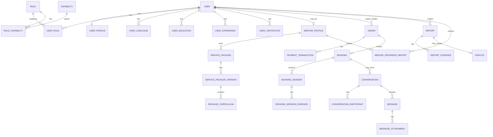

---

## 9. Luồng chính 1 - Buyer tìm và thuê mentor

### Mục tiêu

Buyer tìm được mentor phù hợp, hiểu rõ package, tạo order, thanh toán và có booking/session để thực hiện mentoring.

### Main flow

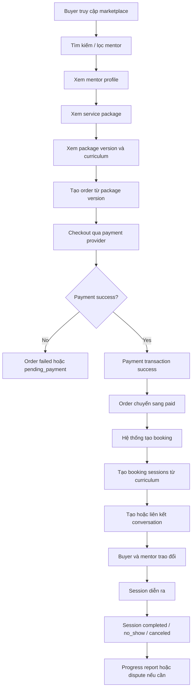

### Điều kiện đầu vào

- Buyer đã đăng nhập.
- Buyer có trạng thái hợp lệ để tạo order/payment.
- Mentor profile đã được platform chấp nhận để public.
- Package version đang active.
- Payment provider sẵn sàng nhận checkout.

### Kết quả đầu ra

- Order được tạo.
- Payment transaction được ghi nhận.
- Nếu payment success: order chuyển `paid`, booking được tạo, sessions được tạo.
- Conversation có thể được tạo hoặc liên kết với booking.

### Edge cases

- Payment webhook đến chậm.
- Payment webhook đến trùng.
- User refresh trang success nhiều lần.
- Payment success nhưng booking create lỗi.
- Package version bị inactive trong lúc checkout.
- Mentor bị suspended sau khi buyer tạo order.
- Lịch/session cần chọn trước checkout nhưng chưa có availability schema.

### Acceptance criteria

- Buyer tạo order từ đúng `service_package_versions.id`.
- Payment success không tạo duplicate order/booking.
- Booking liên kết đúng buyer, mentor, package version và order.
- Booking sessions được tạo theo curriculum hoặc input hợp lệ.
- Buyer và mentor có thể thấy booking của mình.
- Conversation liên quan booking có participant đúng.

---

## 10. Luồng chính 2 - Mentor onboarding và tạo package

### Mục tiêu

User đăng ký làm mentor, hoàn thiện profile, tạo package/version/curriculum và được admin duyệt để public.

### Main flow

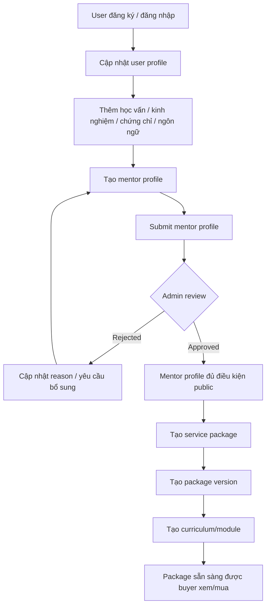

### Điều kiện đầu vào

- User có account hợp lệ.
- User có quyền hoặc capability để apply mentor.
- Mentor profile có thông tin tối thiểu: headline, bio/expertise, base price hoặc thông tin tương đương.
- Nếu có chứng chỉ/evidence, file metadata được lưu đúng.

### Kết quả đầu ra

- Mentor profile được tạo.
- Verification status được cập nhật bởi admin hoặc workflow.
- Service package, version và curriculum được tạo.
- Package có thể hiển thị cho buyer nếu mentor đạt điều kiện public.

### Edge cases

- User chưa active muốn apply mentor.
- Mentor thiếu thông tin bắt buộc.
- Certificate file upload lỗi.
- Admin reject mentor và yêu cầu bổ sung.
- Mentor update package/version khi đã có order/booking.
- Package version cũ cần giữ nguyên để bảo toàn lịch sử order.

### Acceptance criteria

- Mentor tạo được profile.
- Mentor tạo được service package.
- Mentor tạo được package version có price, duration và delivery type.
- Mentor tạo được curriculum cho package version.
- Admin cập nhật được verification status.
- Buyer chỉ thấy mentor/package đủ điều kiện public.

---

## 11. Luồng chính 3 - Payment webhook và tạo booking

### Mục tiêu

Đảm bảo payment được xử lý idempotent, trạng thái order chính xác và booking không bị tạo trùng.

### Main flow

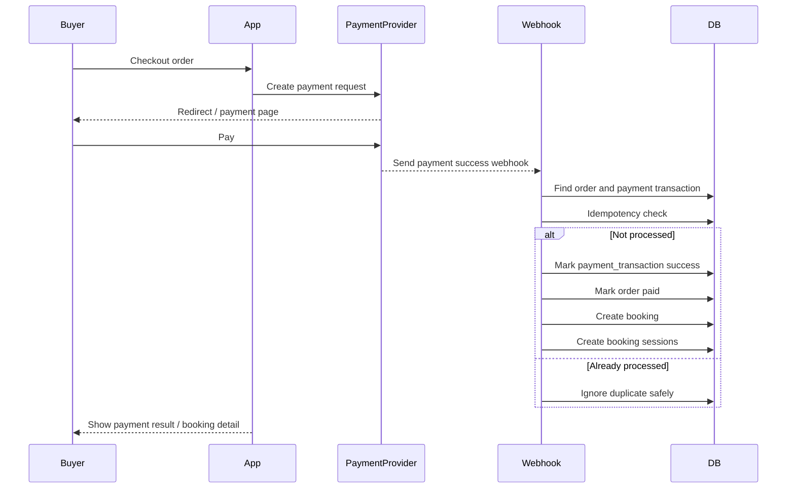

### Business rules

- Webhook phải idempotent.
- Mỗi payment success chỉ được tạo một booking tương ứng.
- Nếu booking creation fail sau payment success, hệ thống phải có retry/reconciliation path.
- Provider raw response phải được lưu để đối soát.
- Order không được nhảy trạng thái trái logic.

### Acceptance criteria

- Duplicate webhook không làm thay đổi dữ liệu sai.
- Payment transaction có trạng thái `success`.
- Order có trạng thái `paid`.
- Booking được tạo đúng một lần.
- Booking sessions được tạo đúng số lượng/kế hoạch.
- Lỗi partial failure được ghi nhận để admin/support xử lý.

---

## 12. Luồng chính 4 - Booking session lifecycle

### Mục tiêu

Quản lý vòng đời các session trong một booking/package.

### Main flow

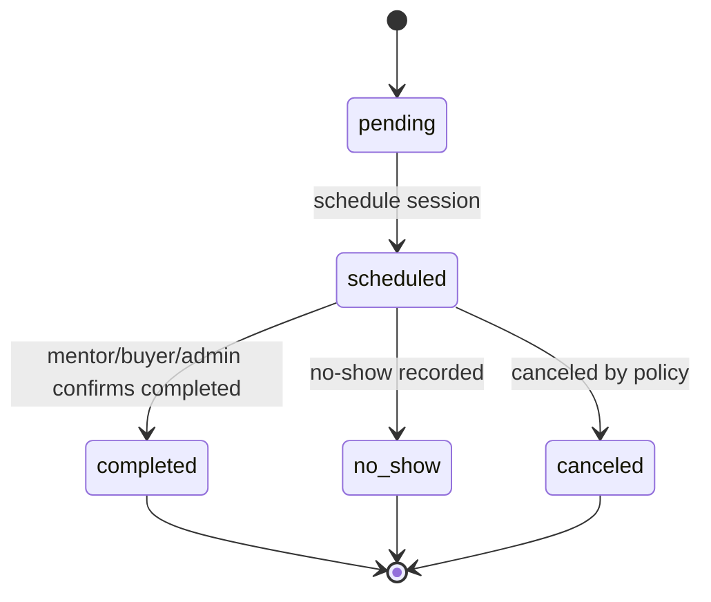

### Business rules

- Booking có thể có nhiều booking sessions.
- `scheduled_at` nằm ở booking session.
- Session có thể có meeting URL.
- Session có thể có evidence.
- No-show cần evidence hoặc note nếu dùng cho dispute/refund.
- Nếu nhiều session trong một package, booking chỉ nên completed khi các session bắt buộc đã completed hoặc được admin xác nhận theo policy.

### Edge cases

- Session diễn ra ngoài nền tảng.
- Mentor/buyer không xác nhận completion.
- Một session no-show nhưng package có nhiều session.
- Cần rebook/reschedule nhưng MVP chưa có flow riêng.
- Meeting URL bị sai hoặc hết hạn.

---

## 13. Luồng chính 5 - Messaging giữa buyer và mentor

### Mục tiêu

Cho phép buyer và mentor trao đổi trước/sau booking trong kênh chính thức.

### Main flow

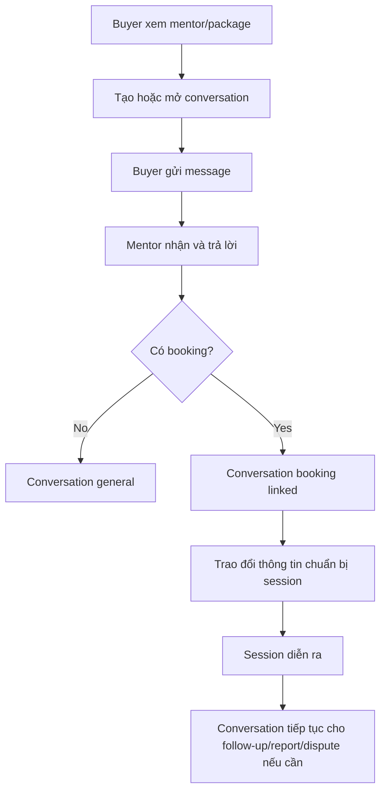

### Business rules

- Chỉ participant trong conversation mới được xem/gửi message.
- Message attachment phải được kiểm tra quyền file.
- MVP chưa cam kết read receipt/unread count chính xác nếu chưa có schema.
- Message bị report có thể tạo report với type `message`.
- Admin chỉ xem conversation nếu có căn cứ vận hành hợp lệ.

### Edge cases

- Hai bên gửi message đồng thời.
- User bị suspended trong lúc conversation đang mở.
- Attachment upload lỗi.
- Người dùng spam message hàng loạt.
- Conversation gắn với booking đã canceled/refunded.

---

## 14. Luồng chính 6 - Report và dispute

### Mục tiêu

Người dùng có thể báo cáo entity vi phạm hoặc mở tranh chấp liên quan booking/session.

### Main flow

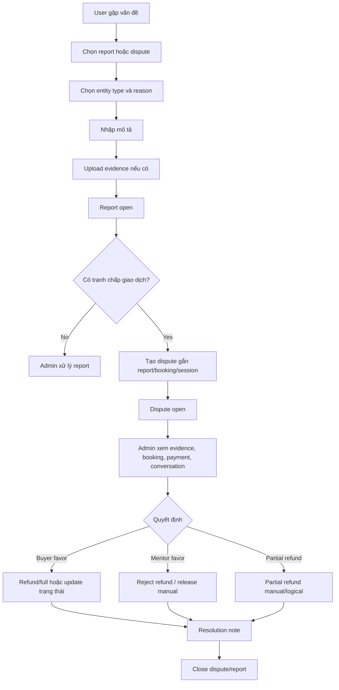

### Business rules

- Report gắn entity bằng `entity_type` và `entity_id`.
- Dispute có thể gắn report, booking hoặc booking session.
- Dispute cần `resolution_note` khi xử lý.
- Nếu dispute đang open/under_review, payout manual không được release.
- Nếu refund, cập nhật order/booking sang `refunded` theo policy.
- Evidence files phải được lưu và phân quyền đúng.

### Edge cases

- User report spam hàng loạt.
- Dispute mở ngoài thời gian cho phép.
- Hai bên bổ sung evidence nhiều lần.
- Evidence file bị xóa mềm.
- Booking không có conversation nhưng vẫn có dispute.
- Partial refund chưa có refund transaction table.

---

## 15. Luồng chính 7 - Progress report

### Mục tiêu

Theo dõi tiến độ mentee sau session hoặc sau package, cho phép mentor feedback.

### Main flow

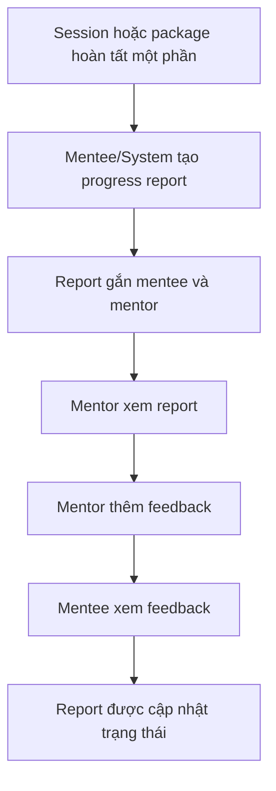

### Business rules

- Progress report chỉ được xem bởi mentee, mentor liên quan hoặc admin có quyền.
- Mentor feedback không được sửa/xem bởi mentor không liên quan.
- Attachment URL hoặc file liên quan cần kiểm tra quyền truy cập.
- Có thể dùng progress report làm dữ liệu follow-up sau mentoring.

---

## 16. Luồng chính 8 - Admin moderation

### Mục tiêu

Admin kiểm soát chất lượng supply, xử lý user/report/dispute và cập nhật trạng thái vận hành.

### Main flow

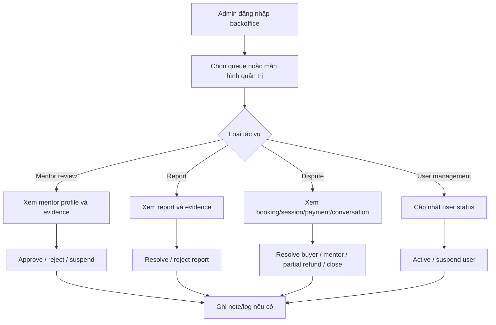

### Business rules

- Admin action nhạy cảm phải có note/log tối thiểu.
- Dù audit log chưa có schema đầy đủ, hệ thống nên lưu operation note ở entity liên quan nếu có trường phù hợp.
- Admin truy cập conversation phải có lý do vận hành.
- Admin không nên sửa payment/refund/payout ngoài policy.

### Màn hình admin MVP

- User management.
- Mentor moderation basic.
- Order/payment lookup.
- Booking/session detail.
- Report queue.
- Dispute queue.
- File/evidence viewer.
- Conversation/support thread viewer nếu có quyền.

---

## 17. State machine data-supported

## 17.1 User

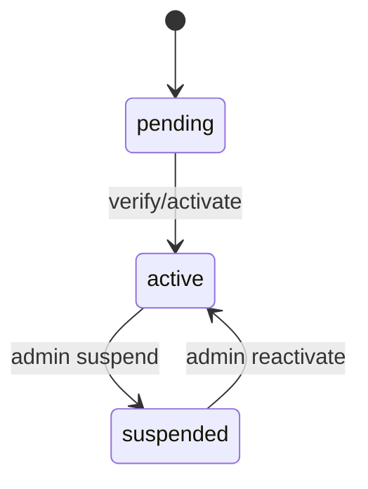

## 17.2 Order

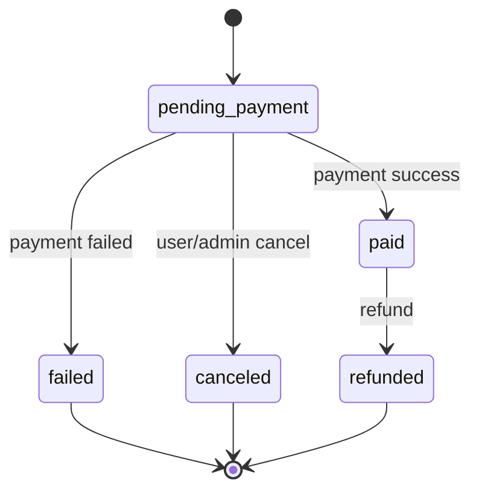

## 17.3 Payment Transaction

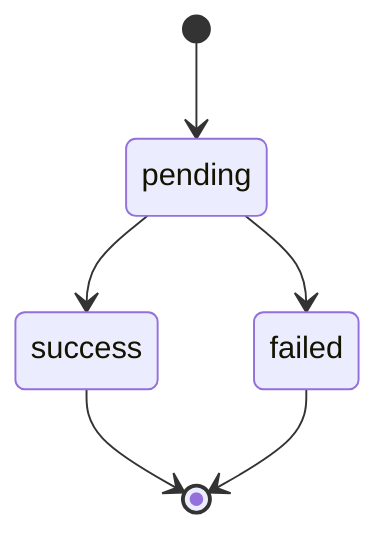

## 17.4 Booking

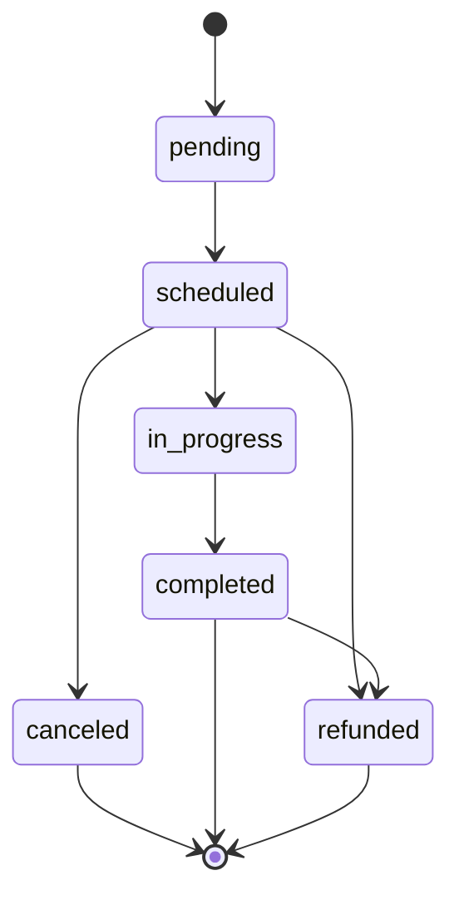

## 17.5 Booking Session

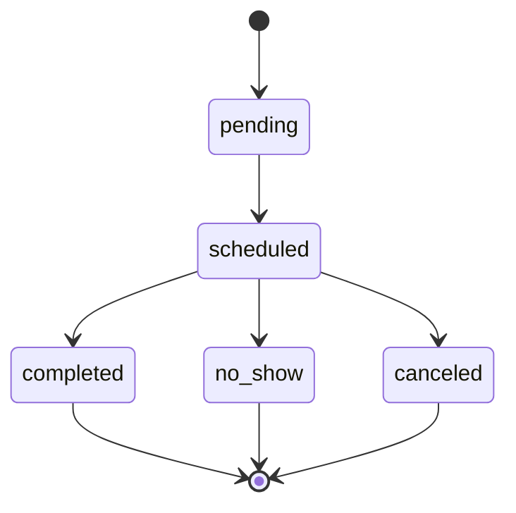

## 17.6 Report

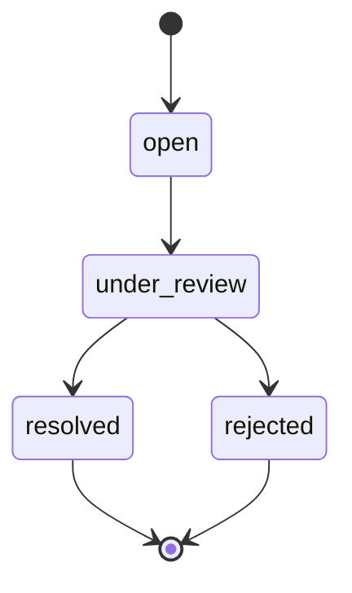

## 17.7 Dispute

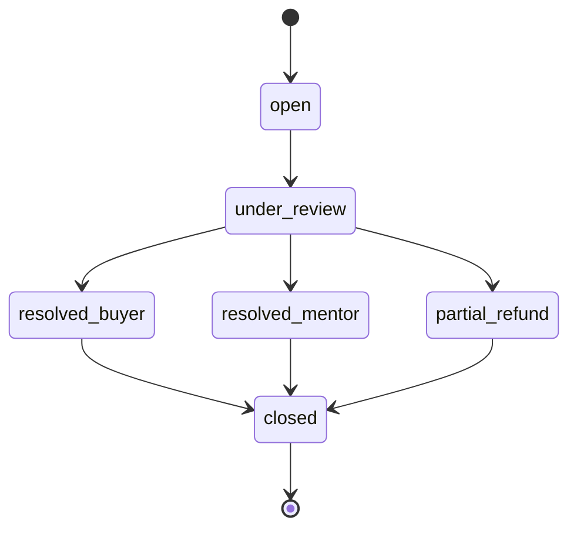

---

## 18. Search, discovery và trust signals

### 18.1 Discovery MVP

Buyer cần có khả năng:

- Xem danh sách mentor.
- Tìm theo keyword.
- Lọc theo thông tin có trong data model hiện tại, ví dụ:
  - expertise text
  - headline
  - base price
  - rating average
  - sessions completed
  - language nếu join được user language
  - trường/ngành nếu join được profile/education
- Xem mentor detail.
- Xem package, package version và curriculum.

### 18.2 Trust signals MVP

Trust signals có thể hiển thị nếu data có sẵn:

- Verification status.
- Rating average aggregate.
- Sessions completed aggregate.
- Bio/headline/expertise.
- Education/experience/certificates.
- Package curriculum rõ ràng.
- Price/duration/delivery type của package version.

### 18.3 Trust signals future

Các trust signals sau nên để future nếu chưa có data model:

- Review list đầy đủ.
- Response rate.
- Response time.
- Completion rate tính động.
- Featured badge.
- Review moderation state.
- Advanced trust score.

---

## 19. Yêu cầu UX/UI chính

### 19.1 Public / Buyer screens

- Landing page.
- Login/register/reset password.
- Mentor listing.
- Mentor detail.
- Package detail.
- Checkout.
- Payment result.
- Buyer dashboard.
- Booking list.
- Booking detail.
- Conversation detail.
- Report/dispute form.
- Progress report list.

### 19.2 Mentor screens

- Mentor profile editor.
- Package manager.
- Package version editor.
- Curriculum editor.
- Booking list.
- Booking session detail.
- Mentor inbox.
- Progress report feedback.

### 19.3 Admin screens

- Admin login.
- User management.
- Mentor moderation basic.
- Order/payment lookup.
- Booking/session detail.
- Report queue.
- Dispute queue.
- File/evidence viewer.
- Conversation/support viewer nếu có quyền.

### 19.4 UX principles

- Giá trị của mentor/package phải rõ trong vài giây đầu.
- Trust signals phải xuất hiện trước checkout.
- Checkout cần ít bước, rõ trạng thái.
- Booking detail phải cho biết session nào sắp diễn ra, trạng thái gì, có conversation/evidence/report/dispute liên quan không.
- Messaging cần đơn giản, mobile-friendly.
- Error state phải rõ ràng, đặc biệt ở payment và upload evidence.

---

## 20. Security, privacy và permission

### 20.1 Nguyên tắc chung

- Resource riêng tư không public trực tiếp.
- Phân quyền dựa trên ownership và capability.
- Admin access cần giới hạn theo vai trò và lý do vận hành.
- File download phải kiểm tra quyền.
- Rate limit cho auth, message creation, report creation và các thao tác nhạy cảm.
- Payment data và provider response phải được bảo vệ.

### 20.2 Permission matrix cấp cao

| Resource | Buyer | Mentor | Admin |
|---|---|---|---|
| Own profile | Read/write | Read/write | Read/support |
| Mentor profile public | Read | Own write | Moderate |
| Package | Read | Own write | Moderate |
| Order | Own read/create | Related read | Read/support |
| Payment transaction | Own read | Related limited read | Read/support |
| Booking | Own read | Related read | Read/support |
| Booking session | Own read | Related read/update limited | Read/update |
| Conversation | Participant read/write | Participant read/write | Read only with reason |
| Message attachment | Participant read | Participant read | Read with reason |
| Report | Own create/read | Related limited | Process |
| Dispute | Own create/read | Related read/respond if supported | Process |
| File evidence | Owner/related read | Related read | Read with reason |

---

## 21. Reliability và consistency

### 21.1 Payment consistency

- Webhook idempotency là bắt buộc.
- Payment success phải tạo booking đúng một lần.
- Cần reconciliation job hoặc admin view để xử lý payment success nhưng booking create lỗi.
- Raw provider response cần được lưu.

### 21.2 Booking consistency

- Booking phải gắn buyer, mentor, package version và order.
- Booking sessions phải gắn booking.
- Nếu chưa có availability slots, không được cam kết slot locking/double-booking prevention ở DB level.
- Schedule conflict cần xử lý ở application layer hoặc future migration.

### 21.3 Messaging consistency

- Message creation cần transaction với attachment metadata nếu có.
- Không cam kết read receipt/unread count chính xác nếu chưa có `message_read_states`.
- Conversation participant là nguồn quyền truy cập chính.

### 21.4 Dispute consistency

- Dispute phải có status rõ ràng.
- Resolution phải có note.
- Refund logical phải cập nhật order/booking status.
- Evidence phải còn truy cập được bởi admin khi xử lý.

---

## 22. Analytics và KPI

### 22.1 KPI sản phẩm

- Mentor profile view to order/booking conversion.
- Checkout started to payment success.
- Payment success to booking created success.
- Booking completion rate.
- Session no-show rate.
- Report/dispute rate.
- Conversation created per booking.
- Repeat buyer rate.

### 22.2 KPI vận hành

- Số mentor pending review.
- Thời gian xử lý mentor review.
- Số report open/under_review.
- Thời gian xử lý dispute.
- Tỷ lệ refund.
- Tỷ lệ payment success nhưng booking creation lỗi.
- Số user bị suspended.
- Số evidence files được upload cho report/dispute.

### 22.3 Lưu ý data-aligned

Nếu chưa có analytics event tracking table, dashboard tự động đầy đủ nên là future phase. MVP có thể dùng query tổng hợp trực tiếp từ các bảng nghiệp vụ hoặc báo cáo thủ công.

---

## 23. Acceptance criteria cấp hệ thống - Data-aligned MVP

MVP được xem là đạt yêu cầu khi:

1. User có thể đăng ký, đăng nhập, refresh token và xác thực bằng OTP.
2. User có role và capability hợp lệ.
3. User có thể cập nhật profile cơ bản.
4. User có thể thêm học vấn, kinh nghiệm, ngôn ngữ và chứng chỉ.
5. Mentor có thể tạo mentor profile.
6. Admin có thể cập nhật verification status của mentor.
7. Mentor có thể tạo service package.
8. Mentor có thể tạo package version với price, duration và delivery type.
9. Mentor có thể tạo curriculum cho package version.
10. Buyer có thể xem mentor/package/version/curriculum đủ điều kiện public.
11. Buyer có thể tạo order từ package version.
12. Hệ thống ghi nhận payment transaction.
13. Khi payment success, order chuyển sang `paid`.
14. Hệ thống tạo booking từ order.
15. Booking có thể tạo một hoặc nhiều booking sessions.
16. Session có thể chuyển qua các trạng thái `scheduled`, `completed`, `no_show`, `canceled`.
17. Buyer và mentor có thể trao đổi qua conversation.
18. Message có thể có attachment.
19. User có thể tạo report.
20. User có thể upload report evidence.
21. User có thể tạo dispute.
22. Admin có thể xử lý report/dispute bằng status và resolution note.
23. File metadata được lưu tập trung.
24. Mentor có thể phản hồi progress report của mentee.
25. Các tài nguyên private được kiểm tra quyền truy cập.

---

## 24. Future phase backlog

### Phase 1 - Trust & Transaction Hardening

- Escrow ledger.
- Payout account.
- Payout batch.
- Refund record.
- Payment webhook log.
- Order/booking timeline.
- Audit log.

### Phase 2 - Scheduling Engine

- Availability slots.
- Recurrence.
- Slot reservation.
- Slot locking.
- Buffer time.
- Timezone-aware availability lookup.
- Reschedule flow.

### Phase 3 - Marketplace Quality

- Expertise categories normalized.
- Topic tags.
- Review table.
- Review moderation.
- Rating breakdown.
- Response rate.
- Response time.
- Completion rate calculation.

### Phase 4 - Communication & Notification

- Message read state.
- Unread count.
- Delivered/read receipt.
- Thread status.
- Notification center.
- Email job retry.
- Push/in-app notification preferences.

### Phase 5 - Analytics & Admin Operations

- Analytics events.
- Admin dashboard metrics.
- Audit log UI.
- Fee rules.
- Refund rules.
- Verification rules.
- Bulk moderation.

---

## 25. Các quyết định cần chốt trước khi build

1. Giữ schema hiện tại và giảm scope PRD, hay giữ PRD v2.1 và bổ sung schema?
2. Mentor session diễn ra ngoài nền tảng hay bắt buộc tích hợp meeting link?
3. Booking có cần chọn lịch trước checkout không? Nếu có, cần bổ sung availability slots hay xử lý application-layer?
4. Refund/no-show/cancellation policy cụ thể là gì?
5. Mentor có được tự set giá không?
6. Có cần review system thật trong MVP không?
7. Có cần notification center không hay chỉ email/basic notification?
8. Có cần audit log production-grade ngay từ đầu không?
9. Có cần payout ledger hay vận hành manual?
10. Có cần chặn chia sẻ thông tin liên hệ cá nhân trong chat không?
11. Attachment trong chat cho phép loại file nào, dung lượng bao nhiêu?
12. Progress report là bắt buộc sau mỗi session hay optional?

---

## 26. Tóm tắt quyết định hệ thống

Nền tảng Mentor Marketplace là một hệ thống giao dịch dịch vụ tri thức. Phần lõi không chỉ là listing và checkout, mà là sự kết hợp của:

1. **Discovery**: buyer tìm được mentor phù hợp.
2. **Trust**: buyer đủ tin tưởng để trả tiền.
3. **Transaction**: order, payment, booking và session được xử lý đúng trạng thái.
4. **Communication**: buyer và mentor phối hợp qua conversation trong nền tảng.
5. **Operations**: admin xử lý report/dispute/evidence đủ rõ ràng.
6. **Data alignment**: MVP chỉ cam kết những gì schema hiện tại hỗ trợ; các năng lực còn thiếu cần được ghi là manual/logical hoặc future phase.

Nếu phải cắt scope, cần giữ lại tối thiểu:

- Mentor profile + package version + curriculum.
- Order/payment + booking/session.
- Conversation/message.
- Report/dispute/evidence.
- Admin xử lý verification/report/dispute.
- File metadata và permission.

---

## 27. Glossary

| Thuật ngữ | Mô tả |
|---|---|
| Buyer / Student / Mentee | Người tìm và mua dịch vụ mentor |
| Mentor | Người cung cấp dịch vụ tư vấn |
| Mentor Profile | Hồ sơ công khai/chuyên môn của mentor |
| Service Package | Gói dịch vụ mentor bán |
| Service Package Version | Phiên bản thương mại của package, có giá/duration/delivery type |
| Curriculum | Nội dung/module/session plan của package version |
| Order | Đơn hàng buyer tạo trước khi thanh toán |
| Payment Transaction | Giao dịch thanh toán qua payment provider |
| Booking | Lịch/giao dịch mentoring được tạo sau khi order paid |
| Booking Session | Buổi cụ thể thuộc một booking |
| Conversation | Cuộc hội thoại giữa các participant |
| Message Attachment | File/ảnh/tệp đính kèm trong message |
| Report | Báo cáo vi phạm gắn với entity |
| Dispute | Khiếu nại giao dịch gắn với report/booking/session |
| Evidence | Bằng chứng cho report/dispute/session |
| Progress Report | Báo cáo tiến độ của mentee có feedback từ mentor |
| Escrow | Cơ chế giữ tiền tạm thời trước khi release cho mentor; MVP hiện tại logical/manual nếu chưa có ledger |
| Payout | Dòng tiền trả mentor; future phase nếu chưa có payout ledger |
| Audit Log | Log hành động nhạy cảm; future phase nếu chưa có schema |
